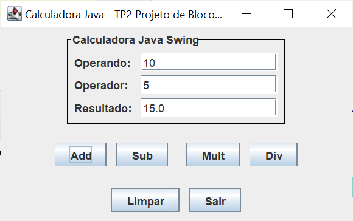

# CalculadoraJavaSwing
Calculadora simples implementada em Java Swing 

# Projeto de Bloco - Desenvolmento Java

## Teste de perfomance 2 

### Escopo

Construir um software simples com interface gráfica utilizando os recursos visuais do NetBeans. O software será uma calculadora com as 4 operações básicas: somar, subtrair, multiplicar e dividir.

A calculadora deve possuir um botão para cada operação. Cada botão aciona um evento, implementado por um método, que deve capturar os dados de entrada em dois campos e exibir o resultado da operação correspondente ao botão em um terceiro campo.

Além do escopo, fora implementado o botão de limpar, que acionado limpa todos os campos e o botão de sair para encerrar a aplicação. 

#### Tela Inicial

#### Realizando uma adição

#### Realizando uma subtração

#### Realizando uma multiplicação

#### Realizando uma divisão

